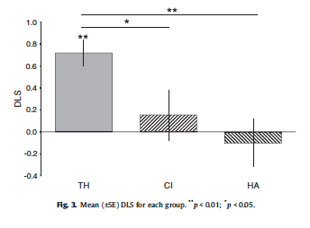

#### Article ID: AgnZI

#### Pilot: Richie Lenne
#### Co-pilot: Gustav Nilsonne
#### Start date: May 2 2017
#### End date: Aug 10 2017
#### Final verification: Tom Hardwicke
#### Date: Nov 8 2017

-------

#### Methods summary: 
There were three groups for comparisons in this analysis. Group 1 (TH-children) included 15 typically hearing Swedish
children. Group 2 (CI-children) consisted of 8 Estonian children with pre-lingual profound hearing loss, who used cochlear implants (CIs). Group 3 (HA-children) included 7 Estonian children without cochlear implants.  
  
Children completed the spontaneous-response false-belief task (SR-FB) in which they watched a video of a cat (Tom) who followed a mouse (Jerry) through a Y-shaped tunnel. Jerry then hid in one of two boxes located outside the tunnel’s exit points, and Tom sought to find Jerry in the appropriate box. In the false-belief test event Tom saw Jerry hide in one box, but then entered a tunnel, missing the fact that Jerry then moved to the other box. The dependent measure was total looking times at the two upper exits of the Y-shaped tunnel. For each child, they calculated a differential looking score (DLS) by subtracting time spent looking for Tom at the incorrect exit from time spent looking him at the correct exit, and by dividing it by the sum of time spent on looking to correct and incorrect exits (DLS-s). They also looked at whether the child's first look was at the correct location.

------

#### Target outcomes:   
For this article please focus on findings reported in Section 3.2 The spontaneous-response FB-task (SR-FB). Specifically, you should attempt to reproduce all descriptive and inferential analyses reported in the text below and associated tables/figures:  

> For the dependent measure we coded total looking times at the two upper exits of the Y-shaped tunnel (Fig. 2). For each child, we then calculated a differential looking score (DLS) by subtracting looking to the incorrect exit from looking to the correct exit, and by dividing it by the sum of time spent on looking to correct and incorrect exits (Senju et al., 2009). The DLS-s range from +1 to -1, DLS-s closer to +1 are considered as anticipatory looking mostly towards the correct area. The mean DLS for each group are shown in Fig. 3.  

> As revealed by a one-way ANOVA, there was a significant difference in DLS between the three groups, F2,27 = 7.31, p = 0.003, g2 = 0.35. Planned contrasts showed that the TH-children outperformed the CI-children, t21 = 2.58, p = 0.017, g2 = 0.24, and the HA-children t20 = 4.01, p = 0.001, g2 = 0.45.  

> Additional t tests showed that the TH-children scored significantly above zero (M = 0.72, SD = 0.40), t14 = 6.87, p < 0.001, g2 = 0.77 (see Fig. 3). In contrast, the DLS did not reach significantly above zero in the CI-children (M = 0.16, SD = 0.65), t7 = 0.68, p = 0.519, g2 = 0.06, or the HA-children (M = -0.10, SD = 0.53), t6 =  0.51, p = 0.629, g2 = 0.04.

> Thirteen out of 15 children in the TH group looked first at the correct location directly after the cat disappeared in the tunnel in search of the mouse (p = 0.007, binomial test). In contrast, 3 out of 8 in the CI group (p=0.727), and 5 out of 7 in the HA-group (p = 0.453) looked first at the correct location.  

> There were no differences in more general looking pattern during the test event between the groups, such as overall looking at the two areas of interest combined (i.e., both exits of the tunnel), F2,27 =1.59, p=0.222, g2 =0.11 (MTH =1.22s, MCI =1.56s, MHA = 1.70 s); or the mean number of fixations (defined as eye movements less than 0.5pixels/ms) during the test event, F2,27 =1.99, p=0.156, g2 =0.13 (MTH =39, MCI =41, MHA =53). Thus, all groups were equally attentive throughout the test event.  

------

```{r global_options, include=FALSE}
knitr::opts_chunk$set(echo=TRUE, warning=FALSE, message=FALSE)

# prepare an empty report object, we will update this each time we run compareValues2()
reportObject <- data.frame("Article_ID" = NA, "valuesChecked" = 0, "eyeballs" = 0, "Total_df" = 0, "Total_p" = 0, "Total_mean" = 0, "Total_sd" = 0, "Total_se" = 0, "Total_ci" = 0, "Total_bf" = 0, "Total_t" = 0, "Total_F" = 0, "Total_es" = 0, "Total_median" = 0, "Total_irr" = 0, "Total_r" = 0, "Total_z" = 0, "Total_coeff" = 0, "Total_n" = 0, "Total_x2" = 0, "Total_other" = 0, "Insufficient_Information_Errors" = 0, "Decision_Errors" = 0, "Major_Numerical_Errors" = 0, "Minor_Numerical_Errors" = 0, "Major_df" = 0, "Major_p" = 0, "Major_mean" = 0, "Major_sd" = 0, "Major_se" = 0, "Major_ci" = 0, "Major_bf" = 0, "Major_t" = 0, "Major_F" = 0, "Major_es" = 0, "Major_median" = 0, "Major_irr" = 0, "Major_r" = 0, "Major_z" = 0, "Major_coeff" = 0, "Major_n" = 0, "Major_x2" = 0, "Major_other" = 0, "affectsConclusion" = NA, "error_typo" = 0, "error_specification" = 0, "error_analysis" = 0, "error_data" = 0, "error_unidentified" = 0, "Author_Assistance" = NA, "resolved_typo" = 0, "resolved_specification" = 0, "resolved_analysis" = 0, "resolved_data" = 0, "correctionSuggested" = NA, "correctionPublished" = NA)
```

## Step 1: Load packages

```{r}
library(tidyverse)
library(haven)
library(knitr)
library(psych)
library(readxl)
library(CODreports)
library(lsr)
library(car) # anova
library(plotrix) # standard error
```

## Step 2: Load data

```{r}
dat_original <- read_excel("data/data.xlsx")
```

## Step 3: Tidy data

NOTE: Article reports that analysis was done on 30 children. An additional 20 children have the scores for DLS but not for other dependent measures. I removed these additional 20. However it should be noted that the article states that only 6 children were removed prior to analysis:  

> To be included in the study, children had to predict in the second familiarization trial that Tom would search for Jerry in the box where Jerry was hiding. Six children (2 TH, 4 CI) did not meet this criterion and were excluded.

```{r}
dat <- dat_original[1:30,]
```

## Step 4: Run analysis

### Pre-processing

```{r}
dat$Group<-as.factor(dat$Group)
```

### Descriptive statistics  

> The DLS-s range from +1 to -1, DLS-s closer to +1 are considered as anticipatory looking mostly towards the correct area. The mean DLS for each group are shown in Fig. 3.  



```{r}
#DLS
desc_table <-dat %>%
  group_by(Group) %>%
  summarize(n=length(`SR-FB (DLS)`),
            mean=mean(`SR-FB (DLS)`,na.rm=T),
            sd=sd(`SR-FB (DLS)`,na.rm=T),
            se=std.error(`SR-FB (DLS)`,na.rm=T))
desc_table
```
We will have to eyeball the standard error values shown in the graph, but the means and sds are reported below:

> Additional t tests showed that the TH-children scored significantly above zero (M = 0.72, SD = 0.40), t14 = 6.87, p < 0.001, g2 = 0.77 (see Fig. 3). In contrast, the DLS did not reach significantly above zero in the CI-children (M = 0.16, SD = 0.65), t7 = 0.68, p = 0.519, g2 = 0.06, or the HA-children (M = -0.10, SD = 0.53), t6 =  0.51, p = 0.629, g2 = 0.04.

```{r}
# extract values from table
TH_m <- desc_table %>% filter(Group == "TH (S1)") %>% pull(mean)
TH_sd <- desc_table %>% filter(Group == "TH (S1)") %>% pull(sd)
TH_se <- desc_table %>% filter(Group == "TH (S1)") %>% pull(se)
HA_m <- desc_table %>% filter(Group == "HA (S1)") %>% pull(mean)
HA_sd <- desc_table %>% filter(Group == "HA (S1)") %>% pull(sd)
HA_se <- desc_table %>% filter(Group == "HA (S1)") %>% pull(se)
CI_m <- desc_table %>% filter(Group == "CI (S1)") %>% pull(mean)
CI_sd <- desc_table %>% filter(Group == "CI (S1)") %>% pull(sd)
CI_se <- desc_table %>% filter(Group == "CI (S1)") %>% pull(se)

# compare values
reportObject <-compareValues2(reportedValue = "0.72", obtainedValue = TH_m, valueType = 'mean')
reportObject <-compareValues2(reportedValue = "0.40", obtainedValue = TH_sd, valueType = 'sd')
reportObject <-compareValues2(reportedValue = "eyeballMATCH", obtainedValue = TH_se, valueType = 'se')
reportObject <-compareValues2(reportedValue = "-0.10", obtainedValue = HA_m, valueType = 'mean')
reportObject <-compareValues2(reportedValue = "0.53", obtainedValue = HA_sd, valueType = 'sd')
reportObject <-compareValues2(reportedValue = "eyeballMATCH", obtainedValue = HA_se, valueType = 'se')
reportObject <-compareValues2(reportedValue = "0.16", obtainedValue = CI_m, valueType = 'mean')
reportObject <-compareValues2(reportedValue = "0.65", obtainedValue = CI_sd, valueType = 'sd')
reportObject <-compareValues2(reportedValue = "eyeballMATCH", obtainedValue = CI_se, valueType = 'se')
```
Let's reproduce the means from here:

> There were no differences in more general looking pattern during the test event between the groups, such as overall looking at the two areas of interest combined (i.e., both exits of the tunnel), F2,27 =1.59, p=0.222, g2 =0.11 (MTH =1.22s, MCI =1.56s, MHA = 1.70 s)

```{r}
#AOIs
desc_table <-dat %>%
  group_by(Group) %>%
  summarize(n=length(`SR-FB (both AOIs)`),
            mean=mean(`SR-FB (both AOIs)`,na.rm=T),
            sd=sd(`SR-FB (both AOIs)`,na.rm=T))
desc_table
```


```{r}
# extract values from table
TH_m <- desc_table %>% filter(Group == "TH (S1)") %>% pull(mean)
HA_m <- desc_table %>% filter(Group == "HA (S1)") %>% pull(mean)
CI_m <- desc_table %>% filter(Group == "CI (S1)") %>% pull(mean)

# compare values
reportObject <-compareValues2(reportedValue = "1.22", obtainedValue = TH_m, valueType = 'mean')
reportObject <-compareValues2(reportedValue = "1.70", obtainedValue = HA_m, valueType = 'mean')
reportObject <-compareValues2(reportedValue = "1.56", obtainedValue = CI_m, valueType = 'mean')
```

Let's reproduce the means from here:

> the mean number of fixations (defined as eye movements less than 0.5pixels/ms) during the test event, F2,27 =1.99, p=0.156, g2 =0.13 (MTH =39, MCI =41, MHA =53).

```{r}
#fixations
desc_table <-dat %>%
  group_by(Group) %>%
  summarize(n=length(`SR-FB (fixations)`),
            mean=mean(`SR-FB (fixations)`,na.rm=T),
            sd=sd(`SR-FB (fixations)`,na.rm=T))
desc_table
```

```{r}
# extract values from table
TH_m <- desc_table %>% filter(Group == "TH (S1)") %>% pull(mean)
HA_m <- desc_table %>% filter(Group == "HA (S1)") %>% pull(mean)
CI_m <- desc_table %>% filter(Group == "CI (S1)") %>% pull(mean)

# compare values
reportObject <-compareValues2(reportedValue = "39", obtainedValue = TH_m, valueType = 'mean')
reportObject <-compareValues2(reportedValue = "53", obtainedValue = HA_m, valueType = 'mean')
reportObject <-compareValues2(reportedValue = "41", obtainedValue = CI_m, valueType = 'mean')
```

All descriptive values successfully reproduced.


### Inferential statistics  
  
> As revealed by a one-way ANOVA, there was a significant difference in DLS between the three groups, F2,27 = 7.31, p = 0.003, g2 = 0.35.

```{r}
mod <- lm(`SR-FB (DLS)` ~ Group, data=dat) 
aov <- anova(mod)
partialES <- lsr::etaSquared(mod, type = 2, anova = F)
```

```{r}
reportObject <- compareValues2(reportedValue = "2", obtainedValue = aov$Df[1], valueType = 'df')
reportObject <- compareValues2(reportedValue = "27", obtainedValue = aov$Df[2], valueType = 'df')
reportObject <- compareValues2(reportedValue = "7.31", obtainedValue = aov$`F value`[1], valueType = 'F')
reportObject <- compareValues2(reportedValue = "0.003", obtainedValue = aov$`Pr(>F)`[1], valueType = 'p')
reportObject <- compareValues2(reportedValue = "0.35", obtainedValue = partialES[[2]], valueType = 'es')
```


> Planned contrasts showed that the TH-children outperformed the CI-children, t21 = 2.58, p = 0.017, g2 = 0.24,

```{r}
# create vector of responses for each group.
THgroup <- as_vector(dat[dat$Group=="TH (S1)",c("SR-FB (DLS)")])
CIgroup <- as_vector(dat[dat$Group=="CI (S1)",c("SR-FB (DLS)")])
HAgroup <- as_vector(dat[dat$Group=="HA (S1)",c("SR-FB (DLS)")])

#t-tests
T1 <- t.test(THgroup,CIgroup, var.equal = T)

# eta-squared: t^2 / t^2 + (n1 + n2 - 2)
T1_ets <- T1$statistic^2 / (T1$statistic^2 + T1$parameter)

reportObject <- compareValues2(reportedValue = "21", obtainedValue = T1$parameter[[1]], valueType = 'df')
reportObject <- compareValues2(reportedValue = "2.58", obtainedValue = T1$statistic[[1]], valueType = 't')
reportObject <- compareValues2(reportedValue = "0.017", obtainedValue = T1$p.value, valueType = 'p')
reportObject <- compareValues2(reportedValue = "0.24", obtainedValue = T1_ets, valueType = 'es')
```

> and the HA-children t20 = 4.01, p = 0.001, g2 = 0.45.

```{r}
T2 <- t.test(THgroup,HAgroup, var.equal = T)

# eta-squared: t^2 / t^2 + (n1 + n2 - 2)
T2_ets <- T2$statistic^2 / (T2$statistic^2 + T2$parameter)

reportObject <- compareValues2(reportedValue = "20", obtainedValue = T2$parameter[[1]], valueType = 'df')
reportObject <- compareValues2(reportedValue = "4.01", obtainedValue = T2$statistic[[1]], valueType = 't')
reportObject <- compareValues2(reportedValue = "0.001", obtainedValue = T2$p.value, valueType = 'p')
reportObject <- compareValues2(reportedValue = "0.45", obtainedValue = T2_ets, valueType = 'es')
```

> Additional t tests showed that the TH-children scored significantly above zero (M = 0.72, SD = 0.40), t14 = 6.87, p < 0.001, g2 = 0.77 (see Fig. 3).

```{r}
T3 <- t.test(THgroup, var.equal = T)

# eta-squared: t^2 / t^2 + (n1 + n2 - 2)
T3_ets <- T3$statistic^2 / (T3$statistic^2 + T3$parameter)

reportObject <- compareValues2(reportedValue = "14", obtainedValue = T3$parameter[[1]], valueType = 'df')
reportObject <- compareValues2(reportedValue = "6.87", obtainedValue = T3$statistic[[1]], valueType = 't')
reportObject <- compareValues2(reportedValue = "eyeballMATCH", obtainedValue = T3$p.value, valueType = 'p') # eyeballing as exact p not reported
reportObject <- compareValues2(reportedValue = "0.77", obtainedValue = T3_ets, valueType = 'es')
```

> In contrast, the DLS did not reach significantly above zero in the CI-children (M = 0.16, SD = 0.65), t7 = 0.68, p = 0.519, g2 = 0.06, 

```{r}
T4 <- t.test(CIgroup, var.equal = T)

# eta-squared: t^2 / t^2 + (n1 + n2 - 2)
T4_ets <- T4$statistic^2 / (T4$statistic^2 + T4$parameter)

reportObject <- compareValues2(reportedValue = "7", obtainedValue = T4$parameter[[1]], valueType = 'df')
reportObject <- compareValues2(reportedValue = "0.68", obtainedValue = T4$statistic[[1]], valueType = 't')
reportObject <- compareValues2(reportedValue = "0.519", obtainedValue = T4$p.value, valueType = 'p')
reportObject <- compareValues2(reportedValue = "0.06", obtainedValue = T4_ets, valueType = 'es')
```

> or the HA-children (M = -0.10, SD = 0.53), t6 = -0.51, p = 0.629, g2 = 0.04.

```{r}
T5 <- t.test(HAgroup, var.equal = T)

# eta-squared: t^2 / t^2 + (n1 + n2 - 2)
T5_ets <- T5$statistic^2 / (T5$statistic^2 + T5$parameter)

reportObject <- compareValues2(reportedValue = "6", obtainedValue = T5$parameter[[1]], valueType = 'df')
reportObject <- compareValues2(reportedValue = "-0.51", obtainedValue = T5$statistic[[1]], valueType = 't')
reportObject <- compareValues2(reportedValue = "0.629", obtainedValue = T5$p.value, valueType = 'p')
reportObject <- compareValues2(reportedValue = "0.04", obtainedValue = T5_ets, valueType = 'es')
```

> Thirteen out of 15 children in the TH group looked first at the correct location directly after the cat disappeared in the tunnel in search of the mouse (p = 0.007, binomial test). In contrast, 3 out of 8 in the CI group (p=0.727), and 5 out of 7 in the HA-group (p = 0.453) looked first at the correct location. 

**Error, see below**  
NOTE: the data files shows 14 of 15 correct in TH group, original article reports 13 of 15. 

ERROR RESOLVED FOLLOWING AUTHOR ASSISTANCE (code block below preserved to show how error was detected)

```{r}
# table(dat$Group,dat$`SR-FB (first look)`)
# 
# # TH
# binom.test(14, 15, p = 0.5, alternative = "two.sided", conf.level = 0.95)
# compareValues(reportedValue = 0.007, obtainedValue = 0.0009766, isP = TRUE)
# 
# # CI
# binom.test(3, 8, p = 0.5, alternative = "two.sided", conf.level = 0.95)
# 
# # HA
# binom.test(5, 7, p = 0.5, alternative = "two.sided", conf.level = 0.95)
```

AUTHOR CLARIFICATION: 

*"What is stated in the article, that ”thirteen out of 15 children in the TH group looked first at the correct location”, is correct. In the supplementary Excel file SR-FB (first look) for the participant P13 should be changed to ”incorrect”. So, yes, this is a typo and must have been incorrectly entered when converting data from the SPSS-file to Excel."*

So let's first change P13 SR-FB to "incorrect":

```{r}
dat[13,]$`SR-FB (first look)` <- 'incorrect'
```

Now run the analyses:

```{r}
table(dat$Group,dat$`SR-FB (first look)`)

# TH
TH_bi <- binom.test(13, 15, p = 0.5, alternative = "two.sided", conf.level = 0.95)
reportObject <- compareValues2(reportedValue = "0.007", obtainedValue = TH_bi$p.value, valueType = 'p')

# CI
CI_bi <- binom.test(3, 8, p = 0.5, alternative = "two.sided", conf.level = 0.95)
reportObject <- compareValues2(reportedValue = "0.727", obtainedValue = CI_bi$p.value, valueType = 'p')

# HA
HA_bi <- binom.test(5, 7, p = 0.5, alternative = "two.sided", conf.level = 0.95)
reportObject <- compareValues2(reportedValue = "0.453", obtainedValue = HA_bi$p.value, valueType = 'p')
```

The error has been resolved with author assistance.

> There were no differences in more general looking pattern during the test event between the groups, such as overall looking at the two areas of interest combined (i.e., both exits of the tunnel), F2,27 =1.59, p=0.222, g2 =0.11 (MTH =1.22s, MCI =1.56s, MHA = 1.70 s); 

```{r}
mod <- lm(`SR-FB (both AOIs)` ~ Group, data=dat) 
aov <- anova(mod)
partialES <- lsr::etaSquared(mod, type = 2, anova = F )

reportObject <- compareValues2(reportedValue = "2", obtainedValue = aov$Df[1], valueType = 'df')
reportObject <- compareValues2(reportedValue = "27", obtainedValue = aov$Df[2], valueType = 'df')
reportObject <- compareValues2(reportedValue = "1.59", obtainedValue = aov$`F value`[1], valueType = 'F')
reportObject <- compareValues2(reportedValue = "0.222", obtainedValue = aov$`Pr(>F)`[1], valueType = 'p')
reportObject <- compareValues2(reportedValue = "0.11", obtainedValue = partialES[[2]], valueType = 'es')
```

> or the mean number of fixations (defined as eye movements less than 0.5pixels/ms) during the test event, F2,27 =1.99, p=0.156, g2 =0.13 (MTH =39, MCI =41, MHA =53). Thus, all groups were equally attentive throughout the test event.

```{r}
mod <- lm(`SR-FB (fixations)` ~ Group, data=dat) 
aov <- anova(mod)
partialES <- lsr::etaSquared(mod, type = 2, anova = F )

reportObject <- compareValues2(reportedValue = "2", obtainedValue = aov$Df[1], valueType = 'df')
reportObject <- compareValues2(reportedValue = "27", obtainedValue = aov$Df[2], valueType = 'df')
reportObject <- compareValues2(reportedValue = "1.99", obtainedValue = aov$`F value`[1], valueType = 'F')
reportObject <- compareValues2(reportedValue = "0.156", obtainedValue = aov$`Pr(>F)`[1], valueType = 'p')
reportObject <- compareValues2(reportedValue = "0.13", obtainedValue = partialES[[2]], valueType = 'es')
```

## Step 5: Conclusion

Initially we were able to reproduce all but one result. The one error was that the article stated that "thirteen out of 15 children in the TH group looked first at the correct location," however according to the data file 14 out of 15 did. The original authors clarified that there was a typo in the data file - P13 should have been labelled 'incorrect' for first look rather than 'correct'. After making this change, the error was resolved. 

```{r}
reportObject$Article_ID <- "AgnZI"
reportObject$affectsConclusion <- "no"
reportObject$error_typo <- 0
reportObject$error_specification <- 0
reportObject$error_analysis <- 0
reportObject$error_data <- 0
reportObject$error_unidentified <- 0
reportObject$Author_Assistance <- T
reportObject$resolved_typo <- 0
reportObject$resolved_specification <- 0
reportObject$resolved_analysis <- 0
reportObject$resolved_data <- 1
reportObject$correctionSuggested <- "no"
reportObject$correctionPublished <- NA

# decide on final outcome
if(reportObject$Decision_Errors > 0 | reportObject$Major_Numerical_Errors > 0 | reportObject$Insufficient_Information_Errors > 0){
  reportObject$finalOutcome <- "Failure"
  if(reportObject$Author_Assistance == T){
    reportObject$finalOutcome <- "Failure despite author assistance"
  }
}else{
  reportObject$finalOutcome <- "Success"
  if(reportObject$Author_Assistance == T){
    reportObject$finalOutcome <- "Success with author assistance"
  }
}

# save the report object
filename <- paste0("reportObject_", reportObject$Article_ID,".csv")
write_csv(reportObject, filename)
```

## Report Object

```{r, echo = FALSE}
# display report object in chunks
kable(reportObject[2:10], align = 'l')
kable(reportObject[11:20], align = 'l')
kable(reportObject[21:25], align = 'l')
kable(reportObject[26:30], align = 'l')
kable(reportObject[31:35], align = 'l')
kable(reportObject[36:40], align = 'l')
kable(reportObject[41:45], align = 'l')
kable(reportObject[46:51], align = 'l')
kable(reportObject[52:57], align = 'l')
```

## Session information

```{r session_info, include=TRUE, echo=TRUE, results='markup'}
devtools::session_info()
```
